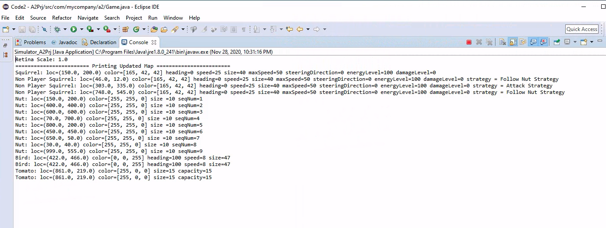
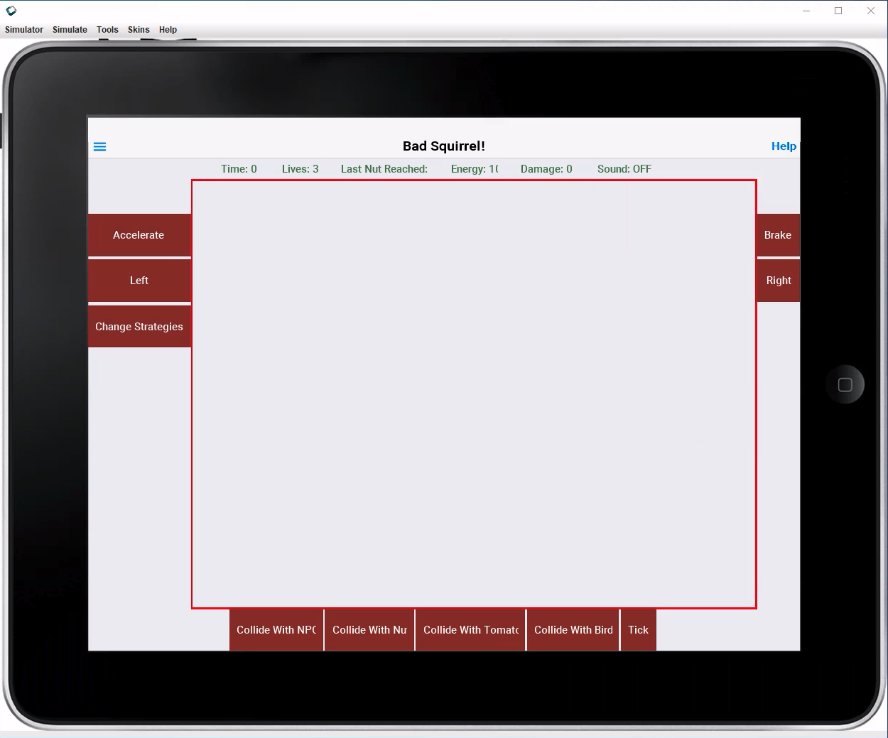
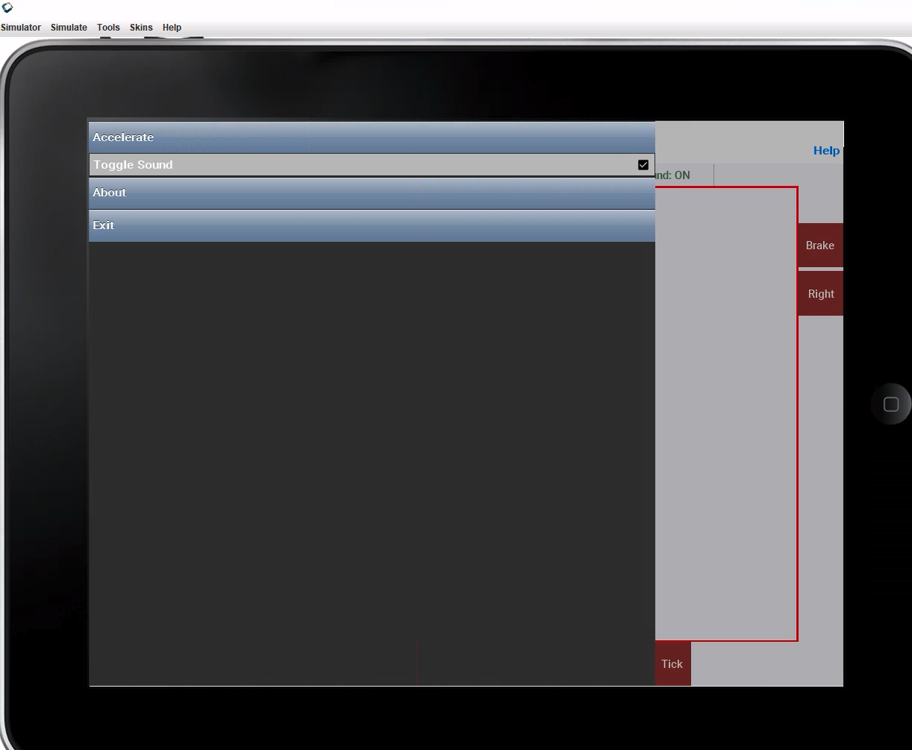
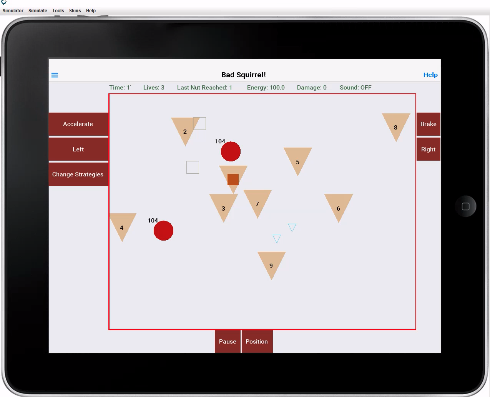
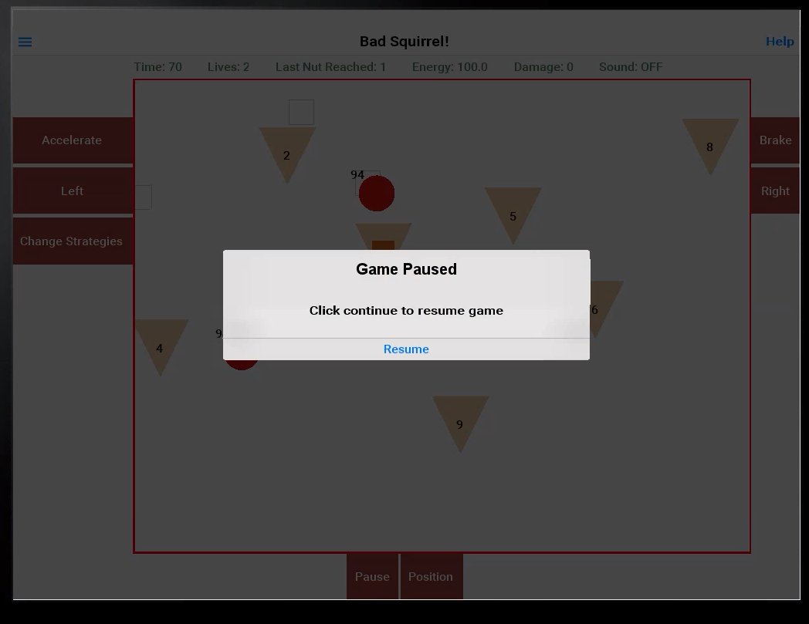
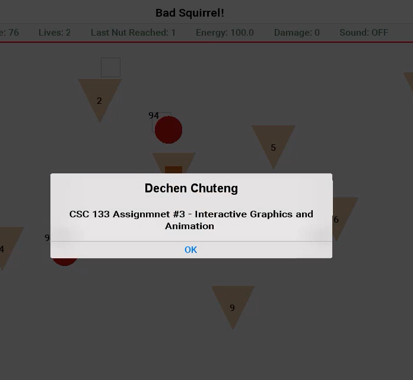
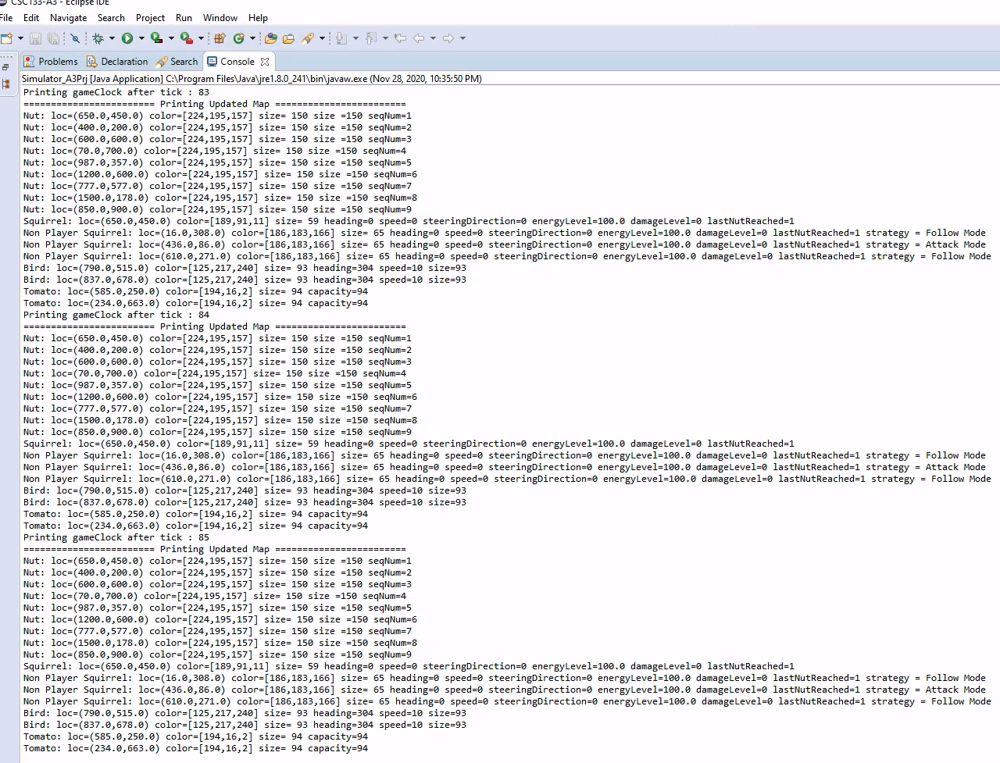

## ⚠️ Disclaimer to students

Please refrain from copying. I will not be held responsible if students copy any of the work presented here. Only use this repository as *reference*.🤓 Thank you.

# CSC 133 Object-Oriented Computer Graphics Programming

> Introduction to computer graphics and advanced topics in object-oriented (OO) programming. The OO paradigm is used throughout, utilizing computer graphics as the vehicle for solidifying basic OO concepts, studying the implementation of event-driven systems, and for developing a thorough understanding of advanced OO concepts such as inheritance and polymorphism. Topics include fundamental concepts of object-oriented programming, software design patterns, graphic devices, line and surface drawing, simple 2D and 3D representation, and use of User Interface components.

## Contents

Created a Java mobile game called _Bad Squirrel_.

- Semester long OOP Project divided up into three assignments: A1, A2, A3
- Created UML diagrams, implemented event-driven systems and movable graphics, and applied OOP concepts to singlehandedly build a mobile game split into 3 deliverables.
- Technologies used were Eclipse IDE and Java GUI functionalities with CodeNameOne API.
- Some functionalities of A3 are not correctly working -- in progress. 

## Screenshots of A2

- Initial Point, Console View

- Initial Point, Console View

- Initial Point, Console View

- A2's About Button View

## Screenshots of A3
- Initial Point, GameWorld View

- Pause Button

- A3's About Button View

- Console View mid-game

